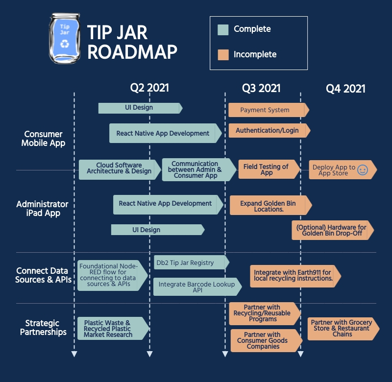

# Tip Jar

## Contents

- [Tip Jar](#submission-or-project-name)
  - [Contents](#contents)
  - [Short Description](#short-description)
    - [What's the Problem?](#whats-the-problem)
    - [How can Technology Help?](#how-can-technology-help)
    - [The Idea](#the-idea)
  - [Demo video](#demo-video)
  - [The Architecture](#the-architecture)
  - [Long Description](#long-description)
  - [Project Roadmap](#project-roadmap)
  - [Getting Started](#getting-started)
  - [Live Demo](#live-demo)
  - [Built with](#built-with)
  - [Authors](#authors)
 

## Short description
Tip Jar is a revolutionary mobile application that rewards everyday consumers with tips for recycling and reusing packaging and food-service plastics.

### What's the problem?
Most of the global plastics waste goes into incineration (25%) and landfills (40%), meaning that these materials are lost forever as a resource, despite plastics’ potential for reuse and recycling. Research shows that currently only 16 percent of plastics waste is reprocessed to make new plastics. One of the root causes being the plastic recycling sector remains very fragmented and relatively immature. 

Meanwhile, over 20 percent of plastic packaging companies have reportedly committed to using recycled plastic and have targets that need to be met by 2025. However, the demand for recycled plastic far outweighs the supply: the compounded annual growth rate of recycled plastic required is 35 percent. There's demand for recycled plastic, but where's the supply?

### How can technology help?

In order to improve plastic recovery rates, improvements in current collection and sorting technology as well as adjustments to consumer recycling behavior are required. Furthermore, one centralized app that combines all recycling/reusable packaging programs would make recycling and reusing plastic packaging more convenient to the consumer.  

### The idea

Tip Jar allows for consumer goods companies to opt in to pay consumers tips for them to sort their recyclables/reusables at home and bring to local drop-off locations. At the expense of a smaller tip, consumers can also discard their recyclables via curbside pickup. Additionally, Tip Jar provides a centralized platform for all recycling/reusable packaging programs (Nutella reusable jar, Starbucks reusable coffee cups, barePack reusable food containers) making it a convenient, and at the same time rewardable, experience for the consumer. 

## Demo video

[View Demo Video Here!!](https://youtu.be/15gEsSF7BWE)

## The architecture

## Long description

[More detail is available here.](./description.md)

## Project roadmap

The project currently does the following things.

Tip Jar User ("Guest User")
1. The user navigates to the Tip Jar mobile application.
2. The user scans the Tip Jar QR code available at checkout (on the payment screen) or on the receipt.
3. The QR code runs the list of barcodes from the receipt against the Tip Jar registry to identify which products are registered with Tip Jar.
4. When finished with the product, the user scans the product barcode which outputs recycling instructions (Ex. EMPTY & REPLACE CAP) and instructs the user to place the product in 1 of 6 color-coded Golden Bins (Ex. Green).
5. When one or more Golden Bins are full (Ex. Green), (Option 1) user identifies Green Golden bin drop-off locations near them or (Option 2) they select
Curbside Pickup for their Green Golden Bin within the Tip Jar app.
6. At the Golden bin drop-off location:
  6a. User first navigates to the Green Golden Bin (Some locations offer more than one Golden bin color).
  6b. The user then scans their Green Golden Bin QR code.
  6c. And finally, the user scans one product's barcode from their Green Golden Bin to collect tips in their Tip Jar.

Tip Jar Golden Bin Administrator ("Golden Bin Administrator")
1. The administrator navigates to the Tip Jar iPad application.
2. The administrator selects 1 of 6 color-coded Golden Bins to setup on site (An iPad and large trash bin are required for setup). The 6 Golden Bin options are color-coded based on Consumer Goods Company (Coca Cola, Unilever, Proctor & Gamble, Kraft Heinz, & Nestle), with the exception of the Yellow To-Go Golden Bin used for discarding reusable To-Go Food Containers and To-Go Coffee Cups.

See below for the proposed schedule on next steps after Call for Code 2021 submission.

## Getting started

Click on the link below for instructions on how to run Tip Jar on your local machine and access the app via your iPhone or iPad. 
- Instructions: Download quickstart.docx.
- Download code here: [tip-jar-react-app](./tip-jar-react-app/)

## User Guide

Download userguide.docx. 

## Live demo

Head to the following link for instructions on how to access the Tip Jar Live Demo (and have your iPad or iPhone ready) 
- https://expo.io/@jjourneycake/welcomeScreen

## Built with

- [IBM Db2](https://www.ibm.com/analytics/db2) - The SQL database used for Tip Jar Registry. 
- [IBM Node-RED](https://nodered.org/docs/getting-started/ibmcloud) - The platform used for connecting data sources and APIs.
- [React Native](https://reactnative.dev/) - Mobile app framework used. 
- [Barcode Lookup API](https://www.barcodelookup.com/api) - API to match UPC barcodes with product names & images. 

## Authors

Jessica Journeycake, IBM Certified L1 Architect
